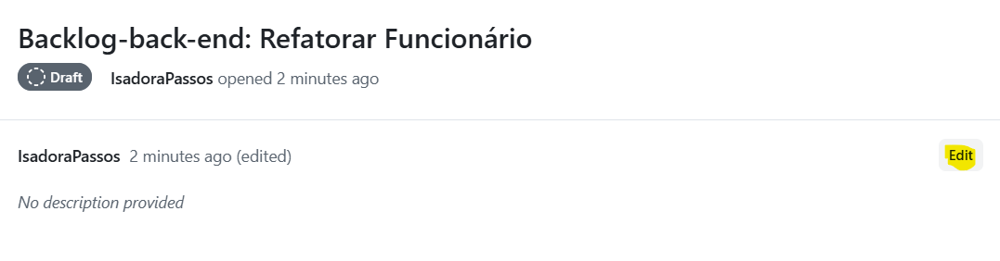
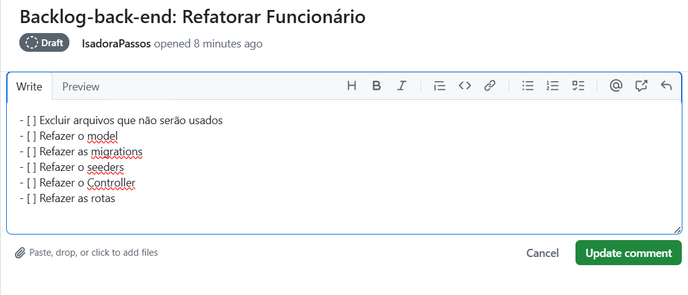
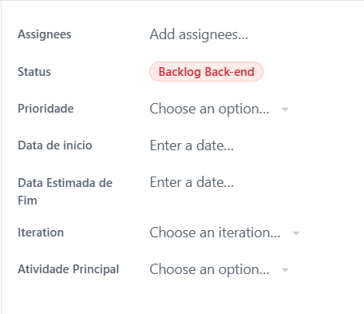
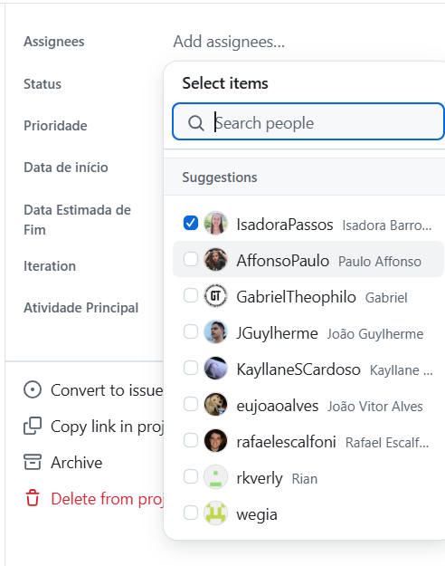
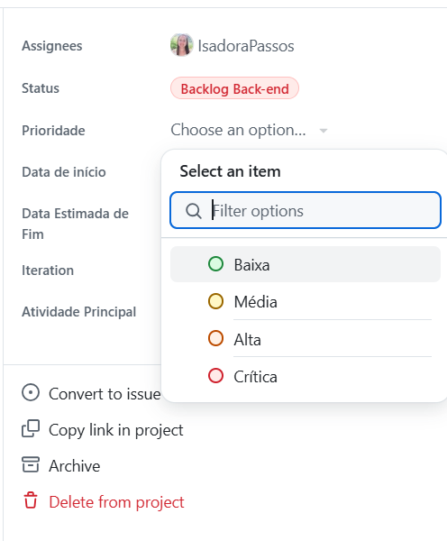
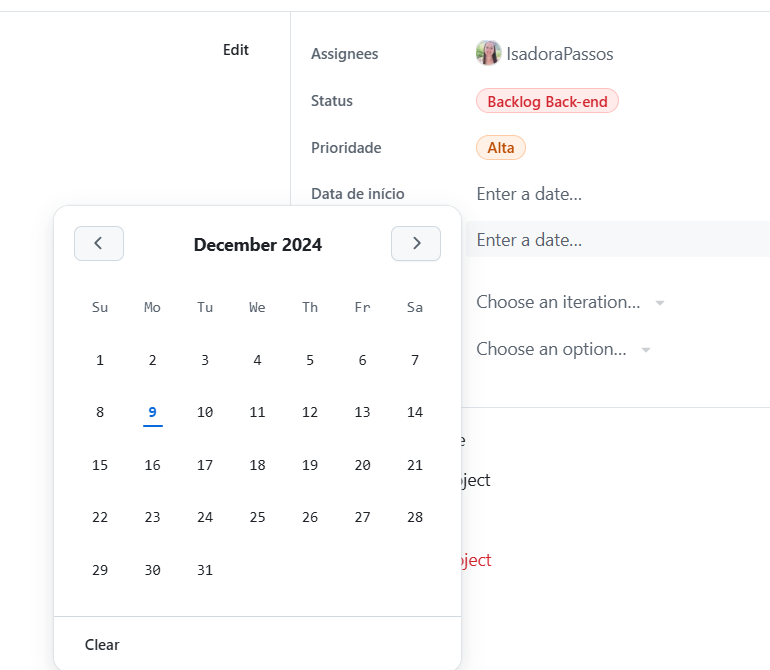
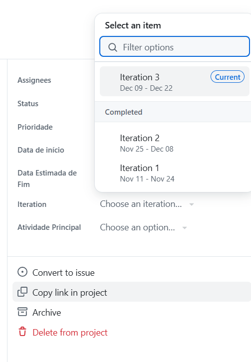
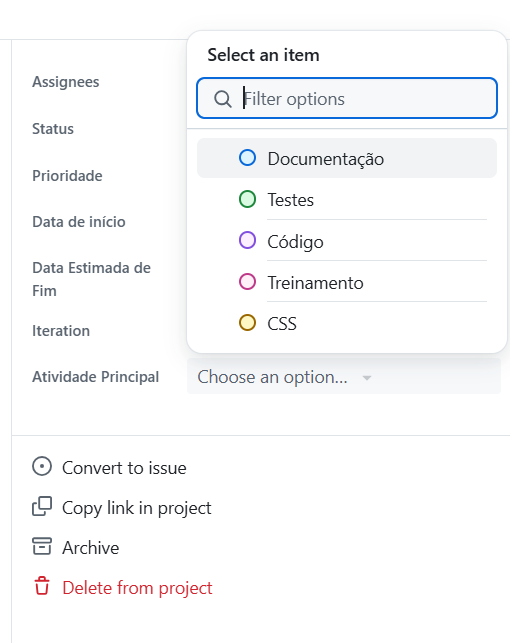

# Tarefas

Este arquivo traz uma explicação de como criar tarefas na aba *Projects* no GitHub.

1. Primeiro, vá até a aba *Projects* e acesse o projeto WeGIA 2.  
2. No quadro Kanban, escolha um backlog e selecione *Add item* no final da coluna.  
3. Digite o nome da tarefa e pressione enter. Busque sempre usar nomes descritivos, mas não muito longos.  
4. Clique na tarefa que agora está no backlog. Ela será exibida com mais detalhes. Clique em *edit* no lado direito da primeira coluna:  
   

5. Forneça uma descrição mais detalhada para a atividade e clique em *update comment* para registrar a mudança:  
   

A coluna mais à direita apresenta algumas opções:  

6. Primeiro, clique em *Add Assignees*. Uma lista dos participantes do projeto será exibida. Selecione quem irá fazer a tarefa, podendo ser você mesmo, outro participante ou um grupo de pessoas:  
   

7. Em seguida, clique na linha de *Prioridades* e selecione a que se encaixa na tarefa. **Em caso de dúvida, consulte a tabela no final do arquivo**:  
   

8. O campo *Data de início* pode ser preenchido na criação, com a data estimada, ou quando a tarefa tiver o status de *Em progresso*. Para isso, basta selecionar a data. A mesma lógica se aplica ao campo *Data estimada de fim*:  
   

9. Também é possível marcar a *Iteration*, que são ciclos de 2 semanas, indicando quando a tarefa será realizada. O ciclo atual fica marcado e é o indicado caso a data estimada de fim esteja dentro dele:  
   

10. Por último, temos a linha *Atividade Principal*, que, como o nome indica, deve representar a atividade central daquela tarefa:  
    

## Matriz de Prioridade

| **Prioridade** | **Descrição** |
|----------------|---------------|
| **Crítica**    | Funcionalidades essenciais ou problemas que impedem o progresso do projeto, como falhas graves na infraestrutura ou requisitos básicos necessários para o lançamento inicial. Essas tarefas têm impacto direto na viabilidade do projeto e devem ser resolvidas imediatamente. |
| **Alta**       | Funcionalidades importantes para atender aos objetivos principais do projeto ou compromissos com a organização parceira. Inclui itens que devem estar prontos para uma versão inicial funcional (MVP). |
| **Média**      | Funcionalidades úteis que complementam o MVP, mas que podem ser postergadas para futuras entregas sem comprometer o lançamento inicial ou o propósito principal do projeto. |
| **Baixa**      | Melhorias desejáveis, como ajustes estéticos, otimizações de desempenho ou funcionalidades adicionais que agregam valor, mas não são prioritárias para o lançamento inicial. Essas tarefas podem ser realizadas como aprendizado ou para refinamento do projeto ao longo do tempo. |
